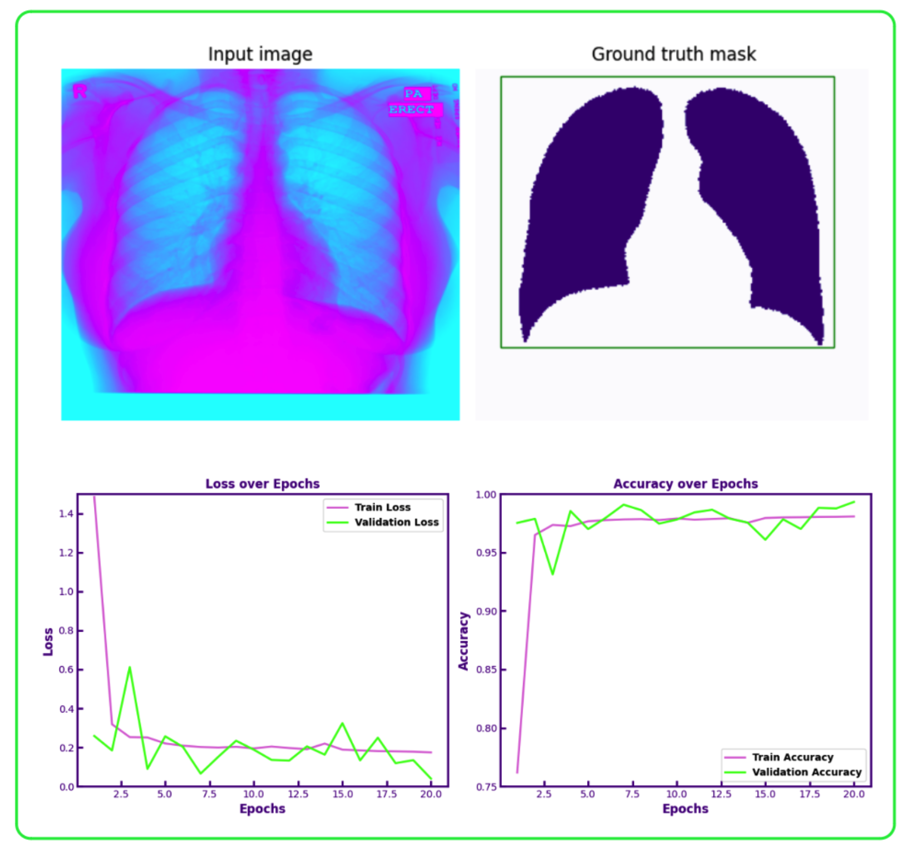

# XraySAM: A Lung Segmentation Model from fine-tuned SAM



This repository contains a fine-tuned version of the medSAM model on lung segmentation. MedSAM model is based on Segment Anything model from Meta (SAM), specially trained on medical image datasets. Here, I fine-tune the SAM model on lung segmenation dataset, obtained from Kaggle (https://www.kaggle.com/datasets/nikhilpandey360/chest-xray-masks-and-labels). The fine-tuned model is available in HuggingFace. 

The comparison of XraySAM and a fine-tuned RESNET50, a CNN based image segmentation model, is given in the report. My study shows that XraySAM with base-ViT (93.7M parameters) performance is on par with RESNET50 model with 800 images, and there is still potential for the model to improve with bigger dataset. Furthermore, with bigger SAM-ViT-Large (312M parameters) or Huge (641M parameters), we can get better performance. 

## Creating environment

To create the conda environment:

`conda create -n xraysam -f environment.yml`

To activate the ***xraysam*:

`conda activate xraysam`

## Dataset Collection:

Dataset can be downloaded from Kaggle (https://www.kaggle.com/datasets/nikhilpandey360/chest-xray-masks-and-labels). An example of how to download the dataset into Colab is given in dataset directory. 

```bash
pip install -q kaggle

mkdir -p root_directory/.kaggle

cp {path_to_kaggle.json} root_directory/.kaggle/

chmod 600 root_directory/.kaggle/kaggle.json

kaggle datasets download -d nikhilpandey360/chest-xray-masks-and-labels

mkdir chest_xray_dataset

mv /content/Lung Segmentation/CXR_png /content/images/

mv /content/Lung Segmentation/masks /content/masks/

cp /content/Lung Segmentation/test/*.png /content/masks/

python path_to_root_directory/file_rename.py /content/masks/

```

## XraySAM model:

XRaySAM is a fine-tuned version of SAM specifically trained on lung-segmentation from chest X-RAYs. I had to modify the dataset to run through SAM. The X-RAY images were resized to 1024 x 1024 and greyscale images were converted to RGB. Also, the segmentation images were resized to 256 x 256. 

This repository contains scripts used to pre-process the dataset, fine-tune and test the model. 

To train the model, use the following script:

`python train.py --dataset path_to_dataset --model model_checkpoint --epochs 20 --device cuda --metric path_to_png`

To test the model:

`python test.py --dataset path_to_dataset --checkpoint path_to_checkpoint_file -device cuda --metric path_to_png`

## Notebook:

The notebook directory contains the colab notebook that processes the dataset, trains and tests the model. In addition to the xraysam model, I have also provided the RESUNET model for comparison.

